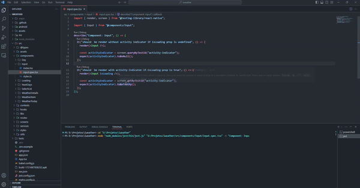

# IWEATHER - Previsão do tempo 

## Sobre o projeto

Este projeto foi desenvolvido durante o módulo de React Native da [Rocketseat](https://www.rocketseat.com.br/). 
O objetivo deste app foi construir testes automatizados, como testes unitários, testes de componentes e testes de integração.
Além disso, configurar o app para o deploy em plataformas como Google Play e Apple Store, seguindo os passos de CI/CD, tudo isso usando o EAS.

